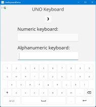
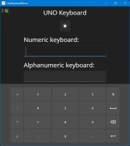

# UnoKeyboard

UnoKeyboard is an on-screen virtual keyboard designed for Desktop, WASM, and Windows platforms.

  

## Features

- Multi-platform support.
- Customizable layout.
- Theme support.
- Customizable appearance (font and size).

## Usage

This library provides an extension method for the `Window` class to display the virtual keyboard. 

The method generates a scaffold with the keyboard layout and adds it to the `Window` content. You can then use the new RootFrame to publish your actual content.

To activate the main window, add the following line to your `App.xaml.cs` file. The control manages focus events using FocusManager, so the keyboard will be shown whenever any TextBox control gets the focus.

```csharp
// Once the keyboard is added to the window, users should use RootFrame to add new content.
public static Frame RootFrame => McWindowEx.RootFrame;

MainWindow.AddKeyboard(height: 300);

// Navigate using McWindowEx.RootFrame
if (RootFrame.Content == null)
{
    RootFrame.Navigate(typeof(MainPage), args.Arguments);
}
```

The extension class `McWindowEx` introduces a new attached property `KeyboardType` that allows keyboard customization. Two default keyboards are provided:

- en-alfa
- numeric

To use a specific keyboard, set the attached property `KeyboardType` in your TextBox control. By default, the keyboard is set to `en-alfa`:

```xml
<Page 
    xmlns:mck="using:UnoKeyboard" />

<TextBox Width="200"
         VerticalAlignment="Center"
         FontSize="30"
         mck:McWindowEx.KeyboardType="numeric" />
```

## Customization

Two static dictionaries are used to define the Keyyboard and the Keys. You can add more keys and keyboard layouts by adding new entries to these dictionaries.

[Keyboards class](src/UnoKeyboard/Keyboards.cs)
