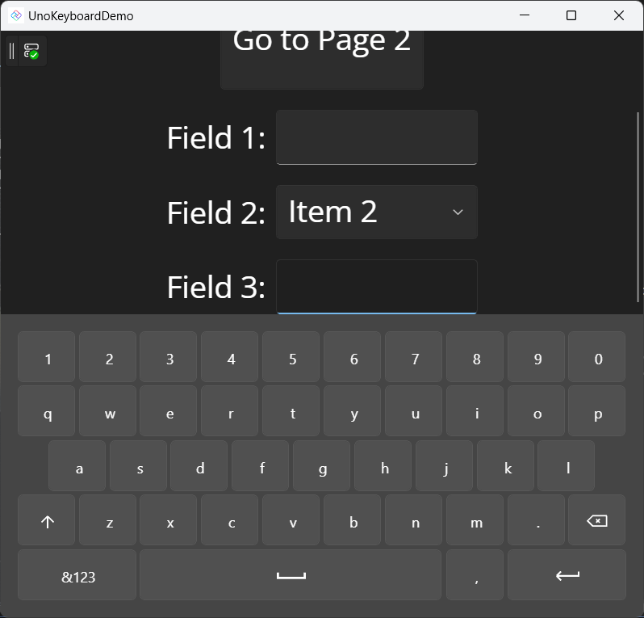

# UnoKeyboard

UnoKeyboard is an on-screen virtual keyboard designed for Desktop, WASM, and Windows platforms.

## Features

- Cross-platform support.
- Customizable layout.
- Theme support.
- Customizable appearance (font and size).

## Usage

This library provides an extension method for the `Window` class to display the virtual keyboard. 

The method generates a scaffold with the keyboard layout and adds it to the `Window` content. You can then use the new RootFrame to publish your actual content.

To activate the main window, add the following line to your `App.xaml.cs` file:The control manages focus events using the FocusManager, so the keyboard will be shown whenever a control receives focus.

## Customization

The extension class `McWindowEx` introduces a new attached property that allows customization of the keyboard layout. Two default keyboards are provided:

- alfa-en
- numeric

To use a specific keyboard, add the `mck:McWindowEx.KeyboardType` attached property to your XAML code:
On screen virtual keyboard for Desktop, WASM and Windows platform.

## Features

- Multi-platform support.
- Customizable layout.
- Theme support.
- Customizable appearance. (Font and size)

## Usage

This library adds an extension method to `Window` class to show the keyboard. 

This method generates a scafold with the keyboard layout and adds it to the `Window` content. Then you can use the new RootFrame to publish your (actual) content.

Add the next line to you `App.xaml.cs` file before to activate the main window.

```csharp
MainWindow.AddKeyboard(height: 300);
```

The control manages focus events using FocusManager, so every time a control gets focus, the keyboard will be shown.

## Customization

The extension class McWindowEx, adds a new attached property to allow customization of the keyboard layout. There are two keyboards supplied by default:

- alfa-en
- numeric

```xaml
<TextBox Width="200"
         VerticalAlignment="Center"
         FontSize="30"
         mck:McWindowEx.KeyboardType="numeric" />
```

